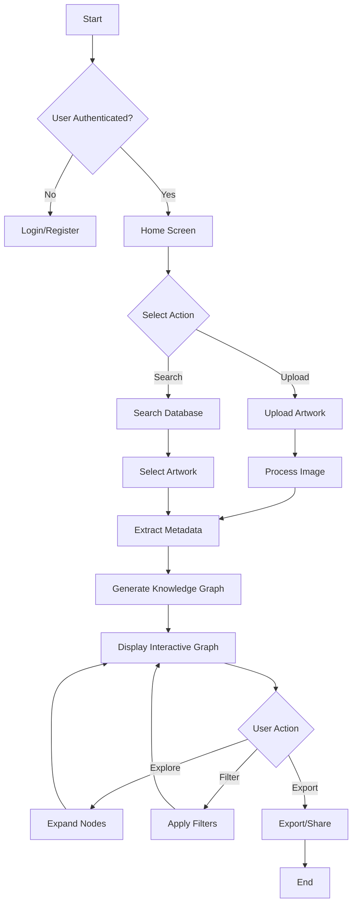
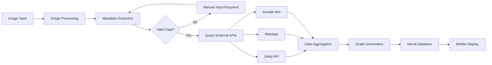
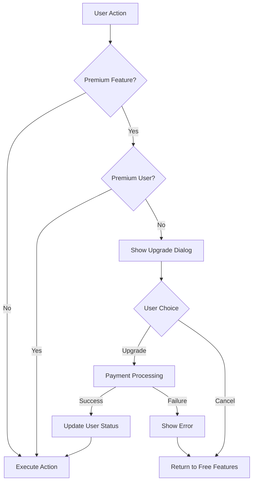
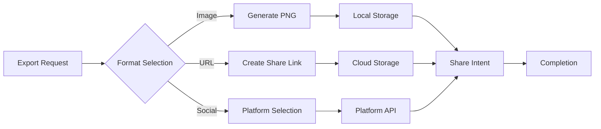
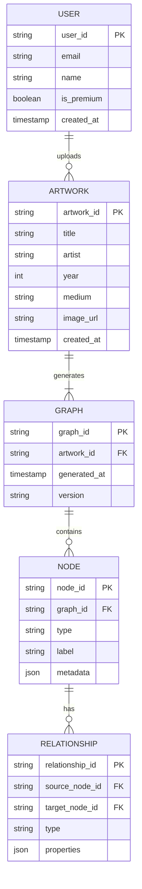
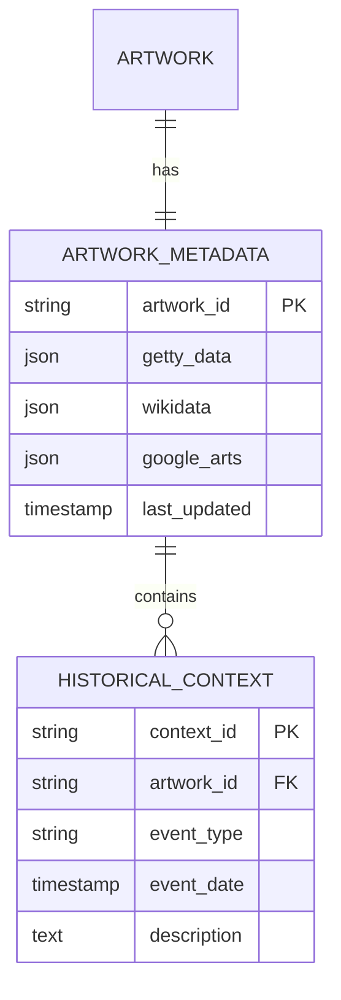
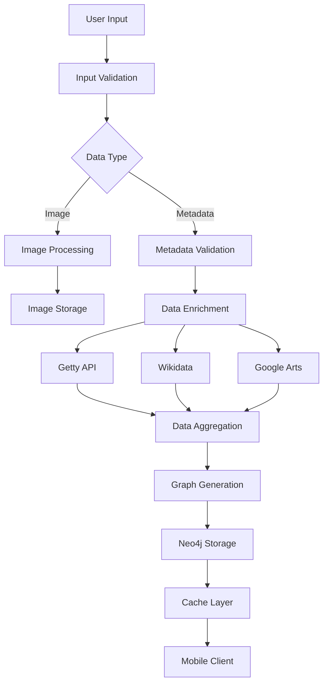

# Product Requirements Document (PRD)

# 1. INTRODUCTION

## 1.1 Purpose

This Software Requirements Specification (SRS) document provides a comprehensive description of the Art Knowledge Graph Mobile Application. It details the functional and non-functional requirements for developers, project managers, QA teams, and stakeholders involved in the development process. The document serves as the primary reference for technical implementation and validation of the delivered system.

## 1.2 Scope

The Art Knowledge Graph Mobile Application is a cross-platform mobile solution that generates interactive knowledge graphs to contextualize artwork within its historical, cultural, and artistic framework. The system encompasses:

- Mobile application for iOS and Android platforms using Flutter/React Native
- Art analysis and metadata extraction capabilities
- Interactive knowledge graph generation and visualization
- Integration with established art databases and APIs
- Export and sharing functionalities

Key benefits include:
- Enhanced understanding of artistic context through visual relationship mapping
- Mobile-first approach for on-the-go art exploration
- Touch-optimized interface for intuitive navigation
- Cross-referenced data from multiple authoritative sources
- Scalable architecture supporting both free and premium user tiers

Core functionalities:
1. Art upload and analysis system
2. Dynamic knowledge graph generation
3. Interactive touch-based graph exploration
4. Multi-source data integration
5. Export and sharing capabilities
6. Tiered access management

Out of scope:
- Desktop or web interfaces
- Original content creation
- Social networking features
- Art authentication services
- Art marketplace functionality

# 2. PRODUCT DESCRIPTION

## 2.1 Product Perspective
The Art Knowledge Graph Mobile Application operates as a standalone mobile solution while integrating with several external systems and services:

- Art Database Integration Layer
  - Getty Art & Architecture Thesaurus
  - Wikidata
  - Google Arts & Culture API

- Cloud Infrastructure
  - Backend services for graph processing
  - Neo4j graph database
  - Authentication services
  - Content delivery network

- Mobile Platform Services
  - iOS and Android native sharing capabilities
  - Device camera and storage access
  - Push notification systems
  - Payment processing systems

## 2.2 Product Functions
The primary functions of the system include:

1. Art Analysis and Processing
   - Image upload and processing
   - Metadata extraction and validation
   - Style and period classification
   - Artist and movement identification

2. Knowledge Graph Operations
   - Dynamic graph generation
   - Real-time graph rendering
   - Interactive node exploration
   - Relationship mapping
   - Filter and search capabilities

3. Data Management
   - Cross-reference verification
   - Cache management
   - Version control of graphs
   - Export functionality

4. User Account Management
   - Tiered access control
   - Preference management
   - History tracking
   - Subscription handling

## 2.3 User Characteristics

1. Art Enthusiasts
   - Basic art knowledge
   - Regular gallery/museum visitors
   - Comfortable with mobile apps
   - Primary use: Personal learning and exploration

2. Art Historians/Researchers
   - Advanced domain knowledge
   - Academic or professional background
   - High technical proficiency
   - Primary use: Research and analysis

3. Educators
   - Moderate to advanced art knowledge
   - Teaching experience
   - Variable technical skills
   - Primary use: Educational material preparation

4. Students
   - Basic to intermediate art knowledge
   - High technical aptitude
   - Limited budget
   - Primary use: Study and assignments

## 2.4 Constraints

1. Technical Constraints
   - Mobile device processing limitations
   - Network bandwidth requirements
   - Graph rendering performance
   - Cross-platform compatibility
   - Storage limitations for offline data

2. External Constraints
   - API rate limits from art databases
   - Copyright and licensing restrictions
   - Data privacy regulations (GDPR, CCPA)
   - App store guidelines

3. Business Constraints
   - Development timeline: 12 months
   - Initial market: English-speaking countries
   - Budget allocation for API access
   - Team size and expertise

## 2.5 Assumptions and Dependencies

### Assumptions
1. Users have consistent internet connectivity
2. Mobile devices meet minimum hardware requirements
3. Art databases maintain stable APIs
4. Users accept cloud storage of their data
5. Market demand remains stable

### Dependencies
1. External Services
   - Art database API availability
   - Cloud infrastructure uptime
   - Payment processing services
   - Mobile platform services

2. Technical Dependencies
   - Flutter/React Native framework stability
   - Graph visualization library compatibility
   - Neo4j database performance
   - Mobile OS version support

3. Business Dependencies
   - Art database licensing agreements
   - Mobile platform developer accounts
   - Cloud service provider contracts
   - Third-party authentication services

# 3. PROCESS FLOWCHART

The following flowcharts illustrate the core processes of the Art Knowledge Graph Mobile Application:

## 3.1 Main User Flow



## 3.2 Data Processing Flow



## 3.3 Premium Feature Access Flow



## 3.4 Export and Sharing Flow



# 4. FUNCTIONAL REQUIREMENTS

## 4.1 Art Analysis and Upload

### ID: F001
### Description
System capability to process artwork through image upload or database selection
### Priority
High
### Requirements

| ID | Requirement | Priority |
|---|---|---|
| F001.1 | Support image upload from device camera and gallery | High |
| F001.2 | Enable artwork search through integrated art databases | High |
| F001.3 | Extract metadata including title, artist, date, medium | High |
| F001.4 | Validate and cross-reference extracted metadata | Medium |
| F001.5 | Support batch processing of multiple artworks | Low |

## 4.2 Knowledge Graph Generation

### ID: F002
### Description
Dynamic creation and rendering of interactive knowledge graphs
### Priority
High
### Requirements

| ID | Requirement | Priority |
|---|---|---|
| F002.1 | Generate graph nodes from artwork metadata | High |
| F002.2 | Create relationships between artistic elements | High |
| F002.3 | Integrate historical context from multiple sources | High |
| F002.4 | Support real-time graph updates | Medium |
| F002.5 | Implement graph caching for offline access | Medium |

## 4.3 Interactive Exploration

### ID: F003
### Description
Touch-based navigation and manipulation of knowledge graphs
### Priority
High
### Requirements

| ID | Requirement | Priority |
|---|---|---|
| F003.1 | Support pinch-to-zoom and pan gestures | High |
| F003.2 | Enable node expansion through tap interaction | High |
| F003.3 | Implement relationship filtering system | Medium |
| F003.4 | Provide contextual information on node selection | High |
| F003.5 | Allow custom annotation of graph elements | Low |

## 4.4 Data Integration

### ID: F004
### Description
Integration with external art databases and APIs
### Priority
High
### Requirements

| ID | Requirement | Priority |
|---|---|---|
| F004.1 | Connect to Getty Art & Architecture Thesaurus | High |
| F004.2 | Integrate with Wikidata API | High |
| F004.3 | Implement Google Arts & Culture API integration | Medium |
| F004.4 | Handle API rate limiting and fallbacks | High |
| F004.5 | Maintain data synchronization across sources | Medium |

## 4.5 Export and Sharing

### ID: F005
### Description
Capabilities for exporting and sharing knowledge graphs
### Priority
Medium
### Requirements

| ID | Requirement | Priority |
|---|---|---|
| F005.1 | Export graphs as high-resolution images | High |
| F005.2 | Generate shareable URLs for graphs | Medium |
| F005.3 | Integrate with native sharing capabilities | Medium |
| F005.4 | Support PDF export format | Low |
| F005.5 | Enable selective sharing of graph segments | Low |

## 4.6 User Account Management

### ID: F006
### Description
User authentication and subscription management
### Priority
High
### Requirements

| ID | Requirement | Priority |
|---|---|---|
| F006.1 | Implement secure user authentication | High |
| F006.2 | Manage premium subscription features | High |
| F006.3 | Track user history and preferences | Medium |
| F006.4 | Support social authentication options | Low |
| F006.5 | Enable account data export | Medium |

# 5. NON-FUNCTIONAL REQUIREMENTS

## 5.1 Performance Requirements

| ID | Requirement | Target Metric |
|---|---|---|
| P001 | Initial app launch time | ≤ 3 seconds |
| P002 | Knowledge graph generation time | ≤ 5 seconds |
| P003 | Graph interaction response time | ≤ 100ms |
| P004 | Image upload processing time | ≤ 4 seconds |
| P005 | Maximum memory usage | ≤ 200MB |
| P006 | Offline data storage limit | ≤ 1GB |
| P007 | API response time | ≤ 2 seconds |
| P008 | Concurrent user support | 10,000 users |

## 5.2 Safety Requirements

| ID | Requirement | Description |
|---|---|---|
| S001 | Data Backup | Automated daily backups with 30-day retention |
| S002 | Failure Recovery | Automatic system state recovery within 5 minutes |
| S003 | Data Validation | Input validation for all user-provided data |
| S004 | Error Handling | Graceful degradation with user-friendly error messages |
| S005 | Version Control | Rollback capability for all system updates |
| S006 | Data Integrity | Checksums for all stored graphs and metadata |

## 5.3 Security Requirements

| ID | Requirement | Description |
|---|---|---|
| SE001 | Authentication | OAuth 2.0 implementation with MFA support |
| SE002 | Data Encryption | AES-256 encryption for data at rest |
| SE003 | API Security | JWT-based API authentication with rate limiting |
| SE004 | Network Security | TLS 1.3 for all data transmission |
| SE005 | Session Management | Automatic session timeout after 30 minutes |
| SE006 | Privacy Controls | GDPR and CCPA compliant data handling |
| SE007 | Access Control | Role-based access control (RBAC) system |

## 5.4 Quality Requirements

### 5.4.1 Availability
- System uptime: 99.9%
- Planned maintenance: Maximum 4 hours per month
- Recovery Time Objective (RTO): 1 hour
- Recovery Point Objective (RPO): 15 minutes

### 5.4.2 Maintainability
- Code documentation coverage: Minimum 80%
- Modular architecture with clear separation of concerns
- Automated testing coverage: Minimum 85%
- Standardized logging and monitoring system

### 5.4.3 Usability
- Maximum 3 clicks to reach any feature
- Touch target size minimum 44x44 points
- Support for accessibility features (VoiceOver, TalkBack)
- Localization support for 5 major languages

### 5.4.4 Scalability
- Horizontal scaling capability up to 100 server instances
- Database sharding support for over 1 million records
- CDN integration for global content delivery
- Auto-scaling based on load metrics

### 5.4.5 Reliability
- Mean Time Between Failures (MTBF): 720 hours
- Mean Time To Repair (MTTR): 2 hours
- Error rate: Maximum 0.1% of all requests
- Data durability: 99.999999999%

## 5.5 Compliance Requirements

| ID | Requirement | Description |
|---|---|---|
| C001 | Data Protection | GDPR and CCPA compliance for user data handling |
| C002 | Accessibility | WCAG 2.1 Level AA compliance |
| C003 | Mobile Standards | iOS App Store and Google Play Store guidelines |
| C004 | API Standards | REST API design following OpenAPI 3.0 specification |
| C005 | Security Standards | OWASP Mobile Top 10 compliance |
| C006 | Cloud Security | SOC 2 Type II compliance for cloud services |
| C007 | Art Licensing | Compliance with digital art reproduction rights |

# 6. DATA REQUIREMENTS

## 6.1 Data Models

### 6.1.1 Core Entity Relationship Diagram



### 6.1.2 Metadata Schema



## 6.2 Data Storage

### 6.2.1 Primary Storage Systems
- Neo4j Graph Database
  - Knowledge graph structures
  - Node relationships
  - Graph metadata
- PostgreSQL
  - User accounts
  - Artwork metadata
  - System configurations
- Object Storage (S3-compatible)
  - Artwork images
  - Exported graph files
  - User-generated content

### 6.2.2 Data Retention
| Data Type | Retention Period | Storage Location |
|-----------|-----------------|------------------|
| User Data | Account lifetime + 90 days | PostgreSQL |
| Artwork Images | 7 years | Object Storage |
| Knowledge Graphs | 5 years | Neo4j |
| System Logs | 90 days | Time-series DB |
| Analytics Data | 2 years | Data Warehouse |

### 6.2.3 Backup and Recovery
- Daily incremental backups
- Weekly full backups
- 30-day backup retention
- Geographic replication across 3 regions
- Recovery time objective (RTO): 1 hour
- Recovery point objective (RPO): 15 minutes

## 6.3 Data Processing

### 6.3.1 Data Flow Diagram



### 6.3.2 Data Security Controls
| Layer | Security Measure |
|-------|-----------------|
| Transport | TLS 1.3 encryption |
| Storage | AES-256 encryption at rest |
| Processing | Memory encryption |
| Access | Role-based access control |
| API | JWT authentication |
| Backup | Encrypted backup storage |

### 6.3.3 Data Processing Rules
1. Artwork Processing
   - Maximum image size: 20MB
   - Supported formats: JPEG, PNG, TIFF
   - Automatic format conversion
   - Metadata extraction timeout: 30s

2. Graph Processing
   - Maximum nodes per graph: 1000
   - Maximum relationships per node: 100
   - Processing timeout: 60s
   - Automatic node pruning for complexity

3. Cache Management
   - Graph cache TTL: 24 hours
   - Metadata cache TTL: 12 hours
   - Maximum cache size: 5GB per instance
   - LRU eviction policy

# 7. EXTERNAL INTERFACES

## 7.1 User Interfaces

### 7.1.1 Mobile Application Screens

| Screen | Primary Functions | Key UI Elements |
|--------|------------------|-----------------|
| Home | Art upload, search, recent activities | - Upload button<br>- Search bar<br>- Recent graphs carousel<br>- Navigation menu |
| Graph View | Knowledge graph interaction | - Zoomable canvas<br>- Node controls<br>- Filter panel<br>- Details sidebar |
| Upload | Image selection and metadata entry | - Camera/gallery picker<br>- Metadata form<br>- Preview panel |
| Search | Database querying and results | - Search filters<br>- Results grid<br>- Sort controls |
| Settings | User preferences and account management | - Account section<br>- Preferences panel<br>- Storage management |

### 7.1.2 UI Requirements

- Minimum touch target size: 44x44 points
- Maximum content width: 428 points (iPhone 13 Pro Max)
- Support for system dark/light modes
- Dynamic text sizing support
- VoiceOver/TalkBack compatibility
- Gesture support for graph manipulation

## 7.2 Hardware Interfaces

### 7.2.1 Mobile Device Requirements

| Component | Specification |
|-----------|--------------|
| Camera | Minimum 8MP resolution for artwork capture |
| Display | Minimum 4.7" screen size, 326 PPI |
| Storage | 2GB available space |
| RAM | Minimum 3GB |
| Processor | ARM64 architecture |
| GPU | OpenGL ES 3.0 support |

### 7.2.2 Sensor Integration

- Accelerometer for orientation changes
- Gyroscope for graph manipulation
- Ambient light sensor for display adjustment
- Touch screen for multi-touch gestures

## 7.3 Software Interfaces

### 7.3.1 External APIs

| API | Purpose | Protocol | Data Format |
|-----|----------|----------|-------------|
| Getty API | Art metadata retrieval | REST | JSON |
| Wikidata | Historical data access | SPARQL | JSON-LD |
| Google Arts & Culture | Artwork information | REST | JSON |
| Neo4j | Graph database operations | Bolt | Binary |
| Cloud Storage | Image and export storage | S3 | Binary |

### 7.3.2 Mobile Platform Services

| Service | Platform | Integration Method |
|---------|----------|-------------------|
| Push Notifications | iOS/Android | Platform-specific APIs |
| In-App Purchases | iOS/Android | StoreKit/Billing API |
| Share Extensions | iOS/Android | Activity/Intent API |
| Authentication | iOS/Android | Sign in with Apple/Google |

## 7.4 Communication Interfaces

### 7.4.1 Network Protocols

| Protocol | Usage | Port |
|----------|-------|------|
| HTTPS | API Communication | 443 |
| WSS | Real-time Updates | 443 |
| TLS 1.3 | Security Layer | N/A |

### 7.4.2 Data Exchange Formats

```json
{
  "artwork": {
    "id": "string",
    "metadata": {
      "title": "string",
      "artist": "string",
      "year": "number"
    },
    "graph": {
      "nodes": [],
      "relationships": []
    }
  }
}
```

### 7.4.3 Integration Requirements

- REST API compliance with OpenAPI 3.0
- JWT authentication for all API requests
- Rate limiting: 100 requests per minute
- Maximum payload size: 10MB
- Compression: gzip for responses
- Cache-Control headers implementation

# 8. APPENDICES

## 8.1 GLOSSARY

| Term | Definition |
|------|------------|
| Knowledge Graph | A network structure representing entities and their relationships in a domain |
| Node | A point in the knowledge graph representing an entity such as artwork, artist, or event |
| Edge | A connection between nodes representing relationships |
| Metadata | Descriptive information about artwork including title, artist, date, medium |
| Graph Traversal | The process of visiting nodes in a graph following edge connections |
| Art Movement | A distinctive style or tendency in art with a specific philosophy or goal |
| Cultural Context | The social, historical, and cultural circumstances surrounding an artwork |
| Touch Target | The interactive area of a UI element designed for touch input |

## 8.2 ACRONYMS

| Acronym | Expansion |
|---------|-----------|
| API | Application Programming Interface |
| CCPA | California Consumer Privacy Act |
| CDN | Content Delivery Network |
| GDPR | General Data Protection Regulation |
| JWT | JSON Web Token |
| LRU | Least Recently Used |
| MFA | Multi-Factor Authentication |
| MTBF | Mean Time Between Failures |
| MTTR | Mean Time To Repair |
| OWASP | Open Web Application Security Project |
| RBAC | Role-Based Access Control |
| REST | Representational State Transfer |
| RPO | Recovery Point Objective |
| RTO | Recovery Time Objective |
| SOC | Service Organization Control |
| TLS | Transport Layer Security |
| TTL | Time To Live |
| WCAG | Web Content Accessibility Guidelines |
| WSS | WebSocket Secure |

## 8.3 ADDITIONAL REFERENCES

1. Technical Standards
   - [Neo4j Graph Database Documentation](https://neo4j.com/docs/)
   - [Flutter Development Guidelines](https://flutter.dev/docs)
   - [React Native Best Practices](https://reactnative.dev/docs/best-practices)
   - [OpenAPI 3.0 Specification](https://swagger.io/specification/)

2. Art Database Resources
   - [Getty Art & Architecture Thesaurus Guidelines](https://www.getty.edu/research/tools/vocabularies/aat/)
   - [Wikidata API Documentation](https://www.wikidata.org/wiki/Wikidata:Data_access)
   - [Google Arts & Culture API Reference](https://developers.google.com/culture)

3. Mobile Development Standards
   - [iOS Human Interface Guidelines](https://developer.apple.com/design/human-interface-guidelines/)
   - [Material Design Guidelines](https://material.io/design)
   - [Mobile Accessibility Guidelines](https://www.w3.org/WAI/standards-guidelines/mobile/)

4. Security Standards
   - [OWASP Mobile Security Testing Guide](https://owasp.org/www-project-mobile-security-testing-guide/)
   - [GDPR Compliance Checklist](https://gdpr.eu/checklist/)
   - [App Store Review Guidelines](https://developer.apple.com/app-store/review/guidelines/)
   - [Google Play Console Guidelines](https://play.google.com/console/about/)