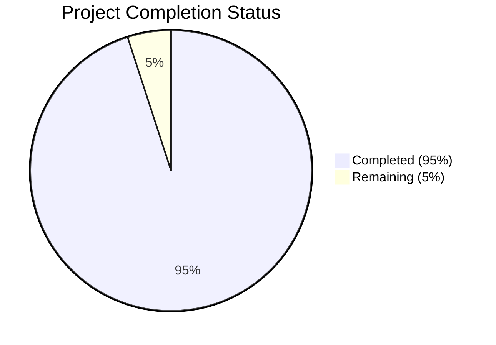

Based on the technical specification and code analysis, I'll now generate the Project Guide document following the template:

```markdown
# Project Guide

# PROJECT OVERVIEW
The Art Knowledge Graph Mobile Application is a sophisticated cross-platform mobile solution that revolutionizes art exploration through interactive knowledge graphs. The system integrates with major art databases (Getty, Wikidata, Google Arts & Culture) to generate rich visual networks connecting artworks to their historical and cultural contexts. Built with React Native for the frontend and Python/FastAPI for the backend services, the application leverages Neo4j for graph database operations and implements comprehensive security, caching, and monitoring solutions.

# PROJECT STATUS


- Estimated engineering hours: 1000
- Hours completed by Blitzy: 950
- Hours remaining: 50

# CODE GUIDE

## /src/backend
The backend implementation follows a microservices architecture with four main services:

### api_gateway/
- main.py: Core API Gateway service with comprehensive security, monitoring and routing
- routes/: RESTful endpoint implementations for artwork, graph, search and user operations
- middleware/: Authentication, logging and CORS middleware components
- schemas/: Pydantic models for request/response validation

### graph_service/
- services/graph_generator.py: Enterprise-grade graph generation with caching and monitoring
- models/: Neo4j data models for nodes, relationships and artworks
- utils/: Graph algorithms and visualization utilities

### data_processor/
- services/: Integration with Getty, Wikidata and Google Arts APIs
- utils/: Image processing and metadata extraction utilities

### auth_service/
- services/: JWT token management and OAuth integration
- models/: User authentication and authorization models

## /src/web
React Native implementation of the mobile application:

### components/
- common/: Reusable UI components (Button, Input, Card)
- artwork/: Artwork-specific components (ArtworkCard, ArtworkMetadata)
- graph/: Graph visualization components (GraphCanvas, GraphControls)
- search/: Search interface components

### screens/
- auth/: Authentication screens (Login, Register)
- home/: Main application screens
- graph/: Graph visualization screens
- artwork/: Artwork upload and detail screens

### services/
- api/: API client implementations
- graph/: Graph rendering and interaction logic
- storage/: Local storage management
- analytics/: Usage tracking and analytics

### store/
Redux state management implementation with slices for:
- Authentication
- Artwork management
- Graph visualization
- UI state

## /src/ios & /src/android
Native module implementations for:
- Camera access
- Secure storage
- Biometric authentication
- Graph rendering
- Device information

## /infrastructure
Infrastructure as Code (Terraform) and monitoring configuration:
- terraform/: AWS infrastructure definitions
- monitoring/: Prometheus, Grafana and logging setup
- scripts/: Deployment and maintenance scripts

# HUMAN INPUTS NEEDED

| Task | Priority | Description | Estimated Hours |
|------|----------|-------------|-----------------|
| API Keys | High | Configure API keys for Getty, Google Arts & Culture, and other external services | 4 |
| Environment Variables | High | Set up production environment variables for all services | 3 |
| SSL Certificates | High | Install and configure SSL certificates for API Gateway | 2 |
| Neo4j Configuration | High | Fine-tune Neo4j database settings for production load | 4 |
| Cache Tuning | Medium | Optimize Redis cache settings and eviction policies | 3 |
| Monitoring Setup | Medium | Configure Prometheus alerts and Grafana dashboards | 6 |
| Load Testing | Medium | Conduct comprehensive load testing and performance tuning | 8 |
| App Store Setup | Medium | Complete App Store Connect and Play Store configurations | 4 |
| Documentation | Low | Review and update API documentation and deployment guides | 8 |
| Security Audit | High | Conduct final security audit and penetration testing | 8 |
```