# Technical Specifications

# 1. INTRODUCTION

## 1.1 EXECUTIVE SUMMARY

The Art Knowledge Graph Mobile Application is a cross-platform mobile solution that revolutionizes how users explore and understand artwork through interactive knowledge graphs. By leveraging modern mobile capabilities and integrating with established art databases, the system generates rich visual networks that connect artworks to their historical, cultural, and artistic contexts. This solution addresses the current gap in mobile-first art exploration tools, providing an intuitive touch-based interface for art enthusiasts, historians, educators, and students.

The application will serve as a comprehensive research and educational tool, enabling users to discover complex relationships between artistic elements while maintaining the portability and accessibility advantages of mobile platforms. Through premium tier offerings and integration with major art databases, the system provides a sustainable solution for both casual users and serious researchers.

## 1.2 SYSTEM OVERVIEW

### Project Context

| Aspect | Description |
|--------|-------------|
| Market Position | First-to-market mobile-native art knowledge graph solution |
| Current Limitations | Existing solutions limited to desktop platforms or static presentations |
| Enterprise Integration | Seamless integration with Getty, Wikidata, and Google Arts & Culture APIs |

### High-Level Description

| Component | Implementation |
|-----------|---------------|
| Mobile Frontend | Cross-platform application using Flutter/React Native |
| Backend Services | Cloud-based processing with Neo4j graph database |
| Data Processing | Python-based metadata extraction and analysis |
| Integration Layer | RESTful APIs with standardized authentication |

### Success Criteria

| Metric | Target |
|--------|--------|
| User Engagement | 15+ minutes average session duration |
| Graph Generation | < 5 seconds processing time |
| Data Accuracy | 99% metadata accuracy rate |
| Platform Stability | 99.9% uptime |

## 1.3 SCOPE

### In-Scope Elements

#### Core Features

| Feature Category | Components |
|-----------------|------------|
| Art Analysis | - Image upload and processing<br>- Metadata extraction<br>- Style classification |
| Graph Generation | - Interactive visualization<br>- Real-time updates<br>- Touch navigation |
| Data Integration | - Multi-source aggregation<br>- Cross-reference validation<br>- Cache management |
| Export Capabilities | - Image export<br>- Share functionality<br>- URL generation |

#### Implementation Boundaries

| Boundary Type | Coverage |
|--------------|----------|
| User Groups | Art enthusiasts, historians, educators, students |
| Geographic Coverage | English-speaking markets initially |
| Platform Support | iOS 14+ and Android 8+ |
| Data Domains | Visual arts, historical context, cultural significance |

### Out-of-Scope Elements

| Category | Excluded Elements |
|----------|------------------|
| Platforms | - Desktop applications<br>- Web interfaces<br>- Smart TV apps |
| Features | - Social networking<br>- Art marketplace<br>- Authentication services<br>- Original content creation |
| Content | - Art valuation<br>- Forgery detection<br>- Conservation analysis |
| Services | - Print-on-demand<br>- Virtual gallery tours<br>- Live streaming |

# 2. SYSTEM ARCHITECTURE

## 2.1 High-Level Architecture

### 2.1.1 System Context Diagram (Level 0)

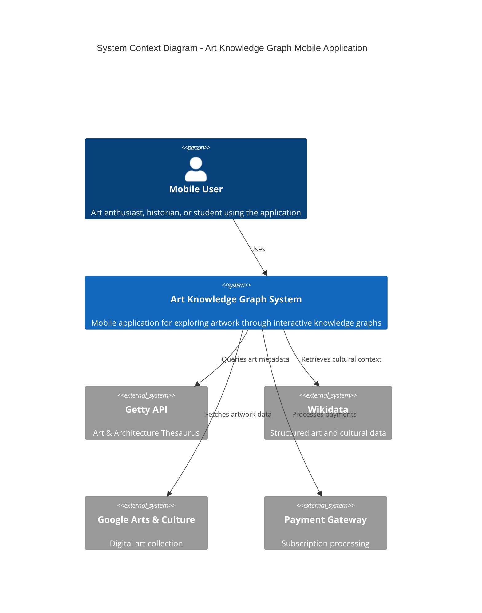

### 2.1.2 Container Diagram (Level 1)

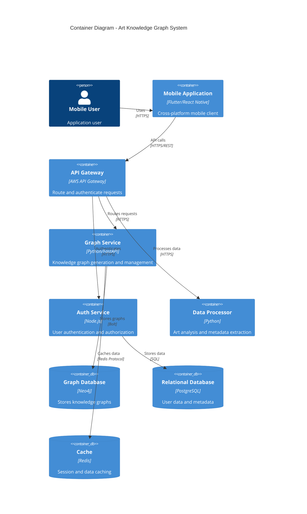

## 2.2 Component Details

### 2.2.1 Mobile Application Components

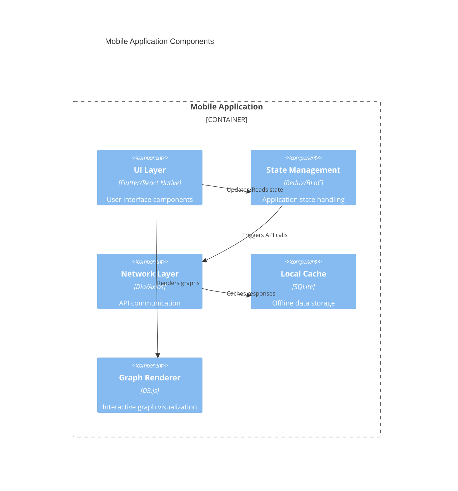

### 2.2.2 Backend Service Components

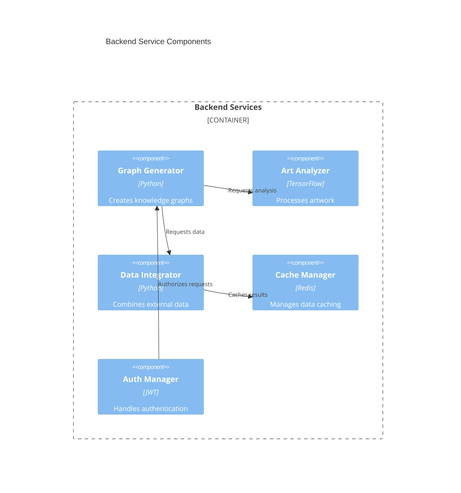

## 2.3 Technical Decisions

### 2.3.1 Data Flow Diagram

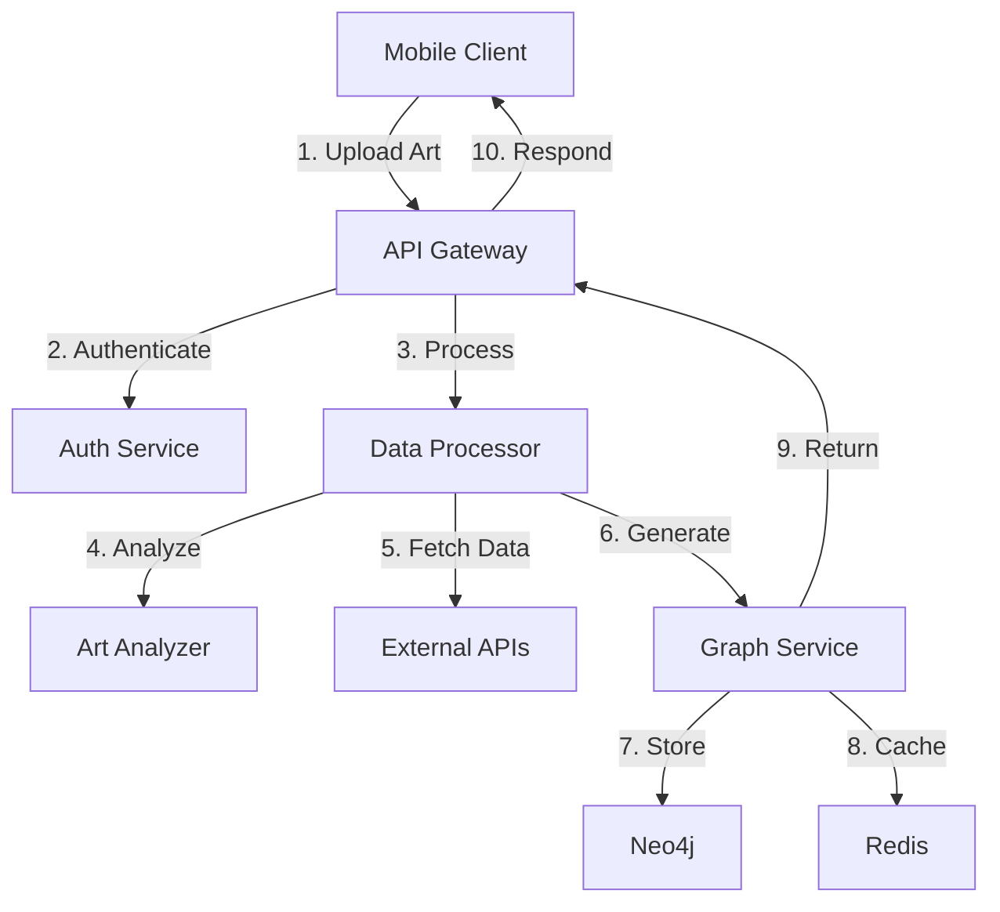

### 2.3.2 Deployment Diagram

```mermaid
flowchart TD
    subgraph Cloud[Cloud Infrastructure]
        subgraph LB[Load Balancer Tier]
            lb[AWS ALB]
        end
        
        subgraph App[Application Tier]
            api[API Containers]
            graph[Graph Service]
            auth[Auth Service]
        end
        
        subgraph Data[Data Tier]
            neo4j[Neo4j Cluster]
            postgres[PostgreSQL]
            redis[Redis Cluster]
        end
        
        subgraph Cache[CDN]
            cdn[CloudFront]
        end
    end
    
    Mobile[Mobile Clients] -->|HTTPS| cdn
    cdn --> lb
    lb --> api
    api --> graph
    api --> auth
    graph --> neo4j
    auth --> postgres
    graph --> redis
```

## 2.4 Cross-Cutting Concerns

### 2.4.1 Monitoring and Observability

| Component | Tool | Metrics |
|-----------|------|---------|
| APM | New Relic | Response times, error rates |
| Logging | ELK Stack | Application logs, audit trails |
| Metrics | Prometheus | System metrics, custom KPIs |
| Tracing | Jaeger | Request tracing, bottleneck analysis |

### 2.4.2 Security Architecture

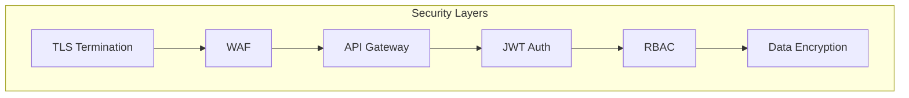

### 2.4.3 Disaster Recovery

| Component | RPO | RTO | Strategy |
|-----------|-----|-----|----------|
| Graph Database | 15 min | 1 hour | Multi-region replication |
| User Data | 5 min | 30 min | Active-passive failover |
| Cache | 0 min | 5 min | Redis cluster with sentinels |
| Application | 0 min | 15 min | Auto-scaling groups |

# 3. SYSTEM COMPONENTS ARCHITECTURE

## 3.1 USER INTERFACE DESIGN

### 3.1.1 Design Specifications

| Category | Requirements |
|----------|--------------|
| Visual Hierarchy | - Primary actions prominently placed at bottom of screen<br>- Critical information in top 30% of viewport<br>- Progressive disclosure for complex graph interactions |
| Design System | - Material Design 3.0 for Android<br>- iOS Human Interface Guidelines for iOS<br>- Custom graph visualization components |
| Responsive Design | - Adaptive layouts for phones (320dp-428dp)<br>- Dynamic type scaling (11pt-23pt)<br>- Orientation support (portrait/landscape) |
| Accessibility | - WCAG 2.1 Level AA compliance<br>- Minimum contrast ratio 4.5:1<br>- VoiceOver/TalkBack support<br>- Reduced motion options |
| Device Support | - iOS 14+ (iPhone 8 and newer)<br>- Android 8.0+ (API level 26+)<br>- Minimum 4.7" screen size |
| Theme Support | - System-based theme switching<br>- Custom color palettes per theme<br>- Persistent theme preference |
| Localization | - RTL layout support<br>- Dynamic string length handling<br>- Date/number formatting<br>- Initial support: EN, ES, FR, DE, JA |

### 3.1.2 Interface Elements

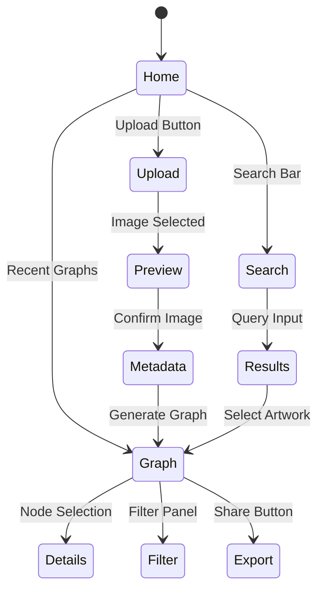

### 3.1.3 Component Specifications

| Component | Behavior | States |
|-----------|----------|---------|
| Graph Canvas | - Pinch zoom (0.5x-3x)<br>- Two-finger pan<br>- Single-tap selection<br>- Double-tap reset | - Loading<br>- Empty<br>- Interactive<br>- Error |
| Node Elements | - Expandable on tap<br>- Draggable with physics<br>- Long-press for details | - Default<br>- Selected<br>- Expanded<br>- Disabled |
| Filter Panel | - Bottom sheet interface<br>- Multi-select filters<br>- Real-time updates | - Collapsed<br>- Expanded<br>- Filtering<br>- No Results |
| Search Bar | - Instant search<br>- History suggestions<br>- Voice input support | - Empty<br>- Typing<br>- Results<br>- No Results |

## 3.2 DATABASE DESIGN

### 3.2.1 Schema Design

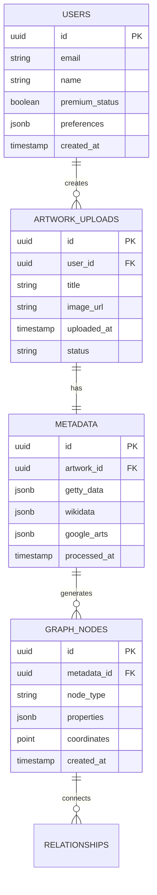

### 3.2.2 Data Management Strategy

| Aspect | Implementation |
|--------|----------------|
| Partitioning | - Time-based partitioning for uploads<br>- Hash partitioning for users<br>- Range partitioning for graphs |
| Indexing | - B-tree indexes on lookup fields<br>- GiST indexes for spatial data<br>- Full-text search on metadata |
| Caching | - Redis for session data (TTL: 24h)<br>- PostgreSQL materialized views<br>- CDN for static assets |
| Backup | - Daily incremental backups<br>- Weekly full backups<br>- 30-day retention<br>- Point-in-time recovery |
| Archival | - Cold storage after 90 days<br>- Metadata retention for 7 years<br>- Compliance with GDPR Article 17 |

## 3.3 API DESIGN

### 3.3.1 API Architecture

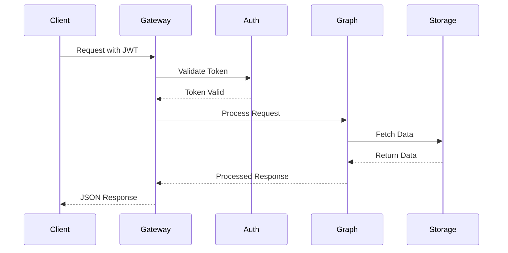

### 3.3.2 API Specifications

| Endpoint | Method | Purpose | Rate Limit |
|----------|--------|---------|------------|
| `/api/v1/artwork` | POST | Upload artwork | 10/min |
| `/api/v1/graph/{id}` | GET | Retrieve graph | 100/min |
| `/api/v1/nodes/{id}` | GET | Node details | 1000/min |
| `/api/v1/search` | GET | Search artwork | 60/min |
| `/api/v1/export/{id}` | POST | Export graph | 30/min |

### 3.3.3 Integration Requirements

| System | Integration Method | Authentication |
|--------|-------------------|----------------|
| Getty API | REST/HTTPS | API Key + OAuth2 |
| Wikidata | SPARQL Endpoint | None |
| Google Arts | REST/HTTPS | OAuth2 |
| Storage | S3 Compatible | IAM Roles |
| Analytics | Event Stream | Service Account |

# 4. TECHNOLOGY STACK

## 4.1 PROGRAMMING LANGUAGES

| Platform/Component | Language | Version | Justification |
|-------------------|----------|---------|---------------|
| Mobile Frontend | Dart | 3.0+ | - Flutter framework compatibility<br>- Strong typing for reliability<br>- High performance on mobile |
| Backend Services | Python | 3.11+ | - Rich data processing libraries<br>- ML/AI capabilities for art analysis<br>- Extensive API support |
| Graph Processing | Python | 3.11+ | - Native Neo4j drivers<br>- Efficient data manipulation<br>- Scientific computing libraries |
| Build Scripts | TypeScript | 5.0+ | - Type safety for build processes<br>- Modern JavaScript features<br>- Cross-platform compatibility |

## 4.2 FRAMEWORKS & LIBRARIES

### Core Frameworks

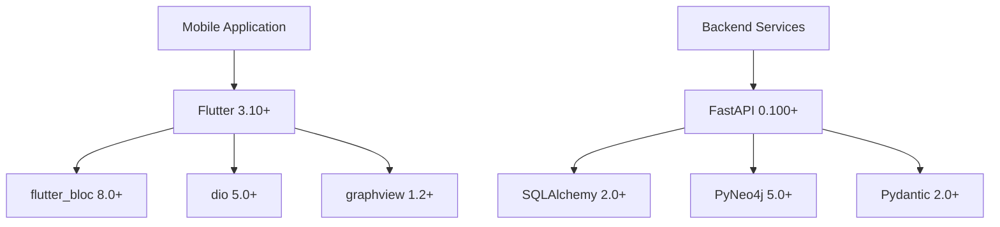

### Supporting Libraries

| Category | Library | Version | Purpose |
|----------|---------|---------|----------|
| Graph Visualization | D3.js | 7.0+ | Interactive graph rendering |
| Image Processing | Pillow | 10.0+ | Artwork image manipulation |
| Data Analysis | pandas | 2.0+ | Metadata processing |
| API Integration | aiohttp | 3.8+ | Async HTTP client |
| Caching | Redis-py | 4.5+ | Distributed caching |
| Testing | pytest | 7.0+ | Backend testing |
| UI Testing | flutter_test | 3.0+ | Mobile app testing |

## 4.3 DATABASES & STORAGE

### Primary Databases

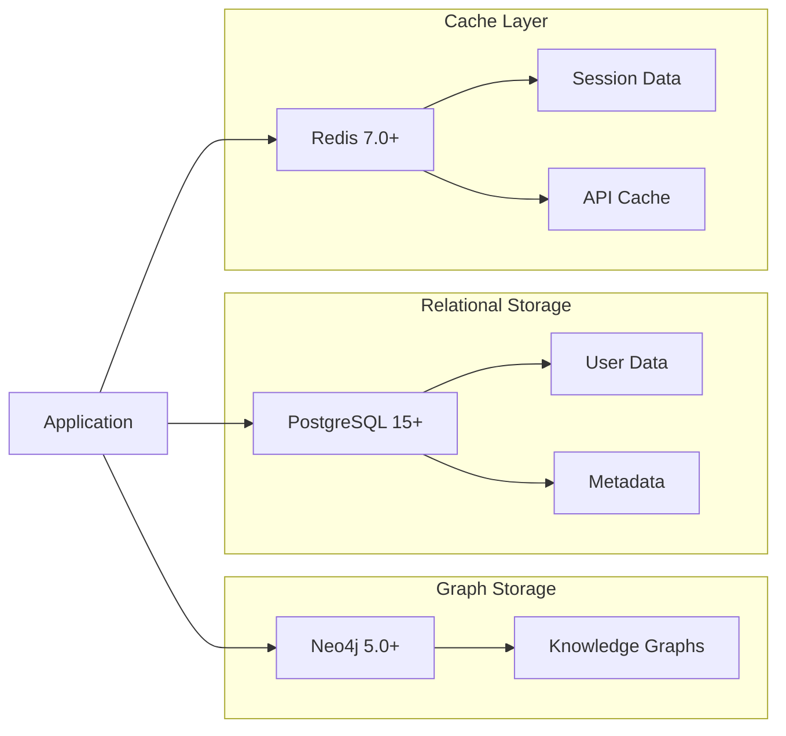

### Storage Services

| Service | Usage | Configuration |
|---------|--------|--------------|
| AWS S3 | Artwork images | - Standard storage class<br>- Cross-region replication<br>- Lifecycle policies |
| CloudFront | CDN | - Edge locations worldwide<br>- HTTPS enforcement<br>- Cache optimization |
| EBS | Database volumes | - Provisioned IOPS<br>- Multi-AZ deployment<br>- Automated backups |

## 4.4 THIRD-PARTY SERVICES

### External Integrations

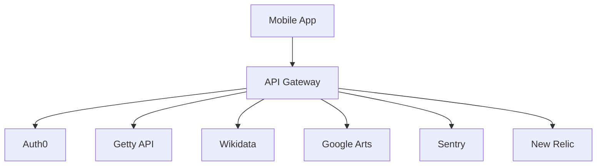

### Service Matrix

| Service | Purpose | Integration Method |
|---------|---------|-------------------|
| Auth0 | Authentication | OAuth2/OIDC |
| Getty API | Art metadata | REST API |
| Wikidata | Knowledge base | SPARQL endpoint |
| Google Arts | Artwork data | REST API |
| Sentry | Error tracking | SDK integration |
| New Relic | Performance monitoring | Agent-based |

## 4.5 DEVELOPMENT & DEPLOYMENT

### Development Pipeline

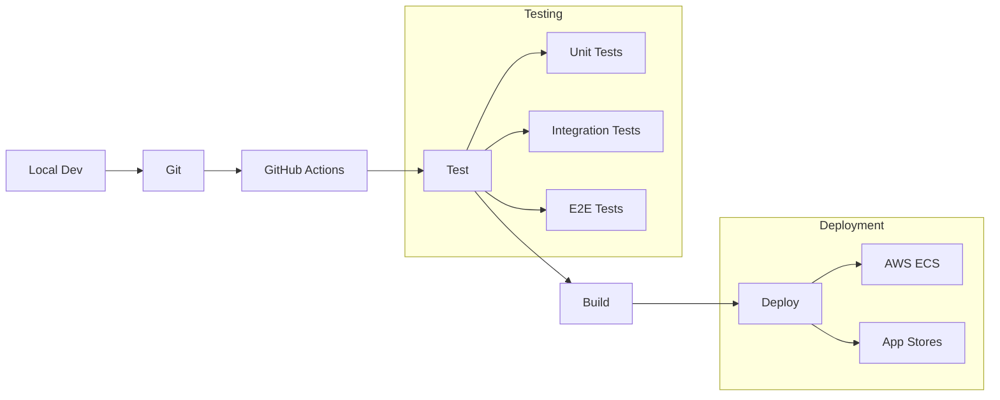

### Build & Deployment Tools

| Category | Tool | Purpose |
|----------|------|---------|
| Code Quality | SonarQube | Static analysis |
| Container Registry | ECR | Image storage |
| Infrastructure | Terraform | IaC management |
| Secrets | AWS Secrets Manager | Credentials management |
| CI/CD | GitHub Actions | Pipeline automation |
| Monitoring | Prometheus/Grafana | System metrics |

# 5. SYSTEM DESIGN

## 5.1 USER INTERFACE DESIGN

### 5.1.1 Core Screen Layouts

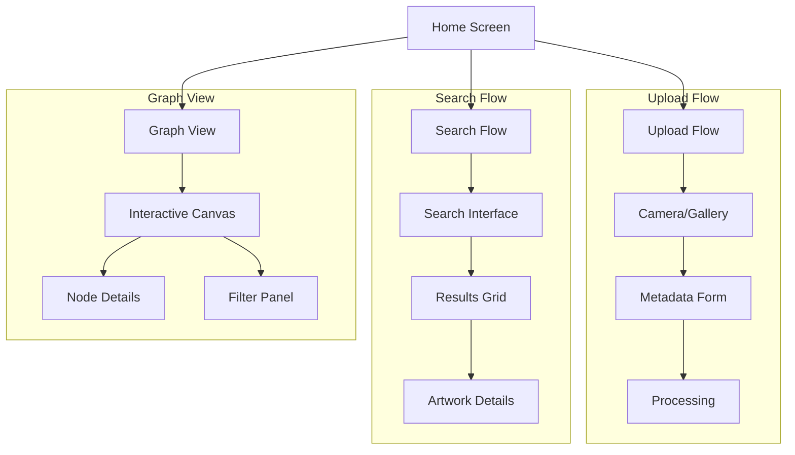

### 5.1.2 Screen Specifications

| Screen | Layout Components | Interaction Elements |
|--------|------------------|---------------------|
| Home | - Top navigation bar<br>- Recent graphs carousel<br>- Action buttons grid<br>- Bottom navigation | - Upload FAB<br>- Search bar<br>- Graph thumbnails<br>- Menu button |
| Graph View | - Full-screen canvas<br>- Bottom sheet panel<br>- Node detail modal<br>- Filter sidebar | - Pinch zoom<br>- Node tap<br>- Edge swipe<br>- Filter toggles |
| Upload | - Camera preview<br>- Form fields<br>- Progress indicator<br>- Confirmation dialog | - Camera trigger<br>- Gallery picker<br>- Input fields<br>- Submit button |

### 5.1.3 Component States

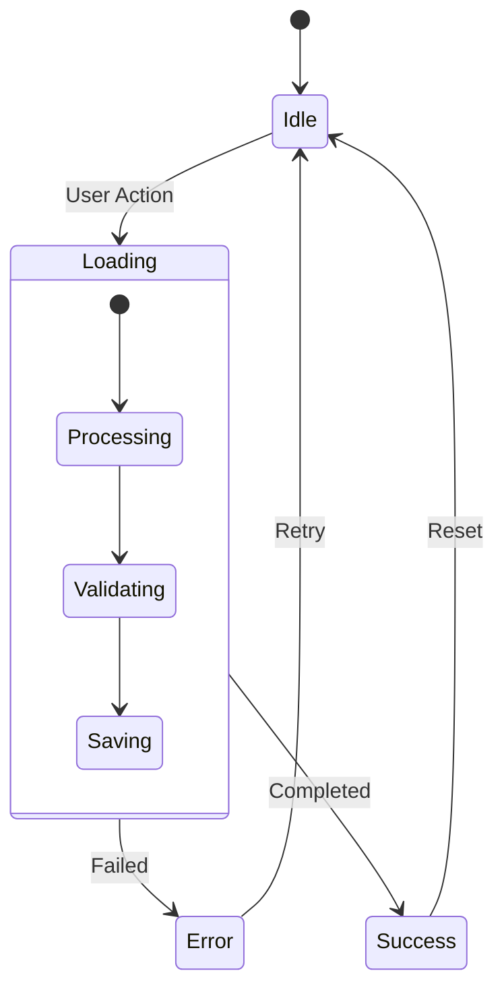

## 5.2 DATABASE DESIGN

### 5.2.1 Graph Database Schema (Neo4j)

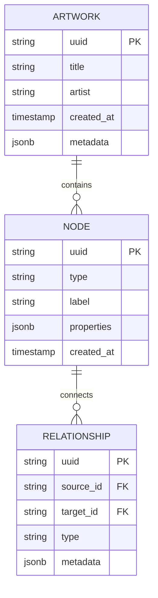

### 5.2.2 Relational Database Schema (PostgreSQL)

| Table | Primary Key | Foreign Keys | Indexes |
|-------|-------------|--------------|---------|
| users | user_id | - | email, created_at |
| artwork_uploads | upload_id | user_id | user_id, created_at |
| metadata | metadata_id | upload_id | upload_id |
| graph_exports | export_id | upload_id, user_id | created_at |

### 5.2.3 Caching Strategy

| Cache Type | Implementation | TTL | Invalidation Strategy |
|------------|----------------|-----|---------------------|
| Graph Cache | Redis | 24h | LRU + Manual |
| API Response | Redis | 1h | Key-based |
| Image Cache | CDN | 7d | Version-based |
| Session Data | Redis | 24h | Expiry + Logout |

## 5.3 API DESIGN

### 5.3.1 RESTful Endpoints

| Endpoint | Method | Purpose | Request Body | Response |
|----------|--------|---------|--------------|-----------|
| /api/v1/artwork | POST | Upload artwork | Multipart form | Artwork metadata |
| /api/v1/graph/{id} | GET | Retrieve graph | - | Graph structure |
| /api/v1/nodes/{id} | GET | Node details | - | Node metadata |
| /api/v1/search | GET | Search artwork | Query params | Results array |
| /api/v1/export/{id} | POST | Export graph | Format specs | Export URL |

### 5.3.2 API Flow

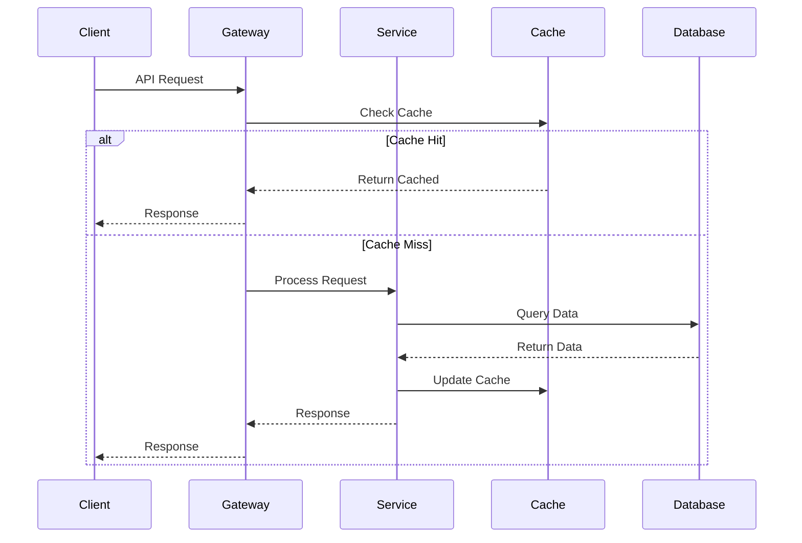

### 5.3.3 WebSocket Events

| Event | Direction | Payload | Purpose |
|-------|-----------|---------|----------|
| graph.update | Server→Client | Graph changes | Real-time updates |
| node.select | Client→Server | Node ID | Selection sync |
| graph.export | Server→Client | Export status | Progress updates |
| error | Bidirectional | Error details | Error handling |

### 5.3.4 Authentication Flow

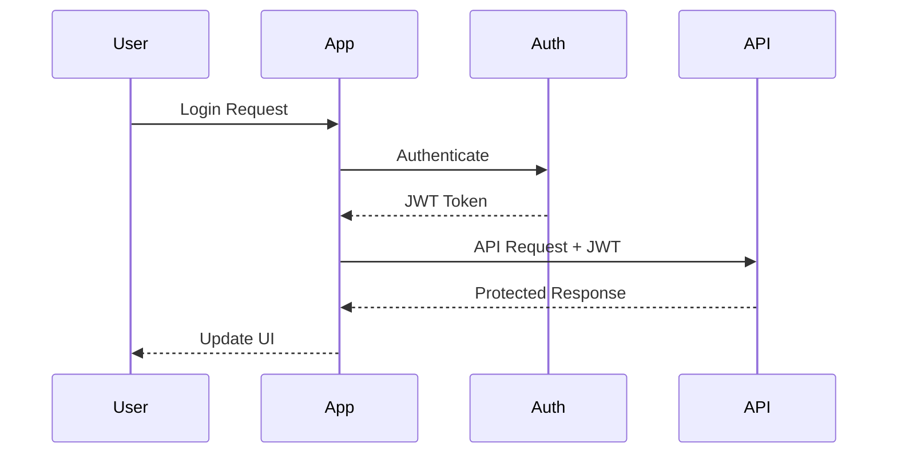

# 6. USER INTERFACE DESIGN

## 6.1 Wireframe Key

```
Icons:                UI Components:
[?] Help              [ ] Checkbox
[$] Payment           ( ) Radio Button
[i] Information       [...] Text Input
[+] Add/Create        [Button] Button
[x] Close             [====] Progress
[<] [>] Navigation    [v] Dropdown
[^] Upload            
[#] Dashboard         Layout:
[@] Profile           +--+ Borders
[!] Warning           |  | Container
[=] Settings          +-- Hierarchy
[*] Favorite
```

## 6.2 Main Screens

### 6.2.1 Home Screen

```
+------------------------------------------+
|[@] Art Knowledge Graph            [=]    |
+------------------------------------------+
| [Search artwork or artists...]           |
+------------------------------------------+
| Recent Graphs                    [>]     |
| +----------------------------------+     |
| |  [Graph 1]    [Graph 2]   [Graph 3]   |
| |                                  |     |
| +----------------------------------+     |
|                                          |
| Featured Collections              [>]     |
| +----------------------------------+     |
| |  [Col 1]     [Col 2]    [Col 3] |     |
| +----------------------------------+     |
|                                          |
| [+] Upload New Artwork                   |
+------------------------------------------+
| [#] Home  [*] Saved  [@] Profile         |
+------------------------------------------+
```

### 6.2.2 Graph View Screen

```
+------------------------------------------+
| [<] Back                    [*] [=]      |
+------------------------------------------+
|                                          |
|     [Artist Node]                        |
|          |                               |
|     [Artwork Node]----[Movement Node]    |
|          |                |              |
|    [Period Node]    [Influence Node]     |
|                                          |
| +----------------------------------+     |
| | Zoom: [====    ] Filter [v]      |     |
| +----------------------------------+     |
|                                          |
| Node Details:                            |
| Title: The Starry Night                  |
| Artist: Vincent van Gogh                 |
| Year: 1889                               |
|                                          |
| [Share] [Export] [Edit]                  |
+------------------------------------------+
```

### 6.2.3 Upload Screen

```
+------------------------------------------+
| [<] Upload Artwork             [?]       |
+------------------------------------------+
|                                          |
| +----------------------------------+     |
| |                                  |     |
| |          [^] Upload Image        |     |
| |              or                  |     |
| |         [Camera] Launch          |     |
| |                                  |     |
| +----------------------------------+     |
|                                          |
| Artwork Details:                         |
| Title:    [...........................] |
| Artist:   [...........................] |
| Year:     [.......] [i]                 |
| Medium:   [v]                           |
|                                          |
| [====] Processing                        |
|                                          |
| [Generate Graph]                         |
+------------------------------------------+
```

### 6.2.4 Search Results

```
+------------------------------------------+
| [<] Search Results            [=]        |
+------------------------------------------+
| [...Search term...]          [Filter v]  |
|                                          |
| Sort by: ( ) Relevance ( ) Date ( ) A-Z  |
|                                          |
| Results:                                 |
| +----------------------------------+     |
| | Artwork 1                        |     |
| | [Preview] Artist, Year          [>]    |
| +----------------------------------+     |
| | Artwork 2                        |     |
| | [Preview] Artist, Year          [>]    |
| +----------------------------------+     |
| | Artwork 3                        |     |
| | [Preview] Artist, Year          [>]    |
| +----------------------------------+     |
|                                          |
| [Load More]                              |
+------------------------------------------+
```

## 6.3 Modal Dialogs

### 6.3.1 Export Dialog

```
+----------------------------------+
| Export Graph                 [x] |
+----------------------------------+
| Format:                          |
| ( ) PNG Image                    |
| ( ) PDF Document                 |
| ( ) Share URL                    |
|                                  |
| Quality: [v]                     |
| Include: [ ] Metadata            |
|         [ ] Annotations          |
|                                  |
| [Cancel]        [Export]         |
+----------------------------------+
```

### 6.3.2 Filter Panel

```
+----------------------------------+
| Filter Graph                 [x] |
+----------------------------------+
| Time Period:                     |
| [============================]   |
| 1800                       2023  |
|                                  |
| Art Movements: [v]              |
| [ ] Impressionism               |
| [ ] Post-Impressionism          |
| [ ] Modernism                   |
|                                  |
| Relationships:                   |
| [ ] Artists                     |
| [ ] Influences                  |
| [ ] Historical Events           |
|                                  |
| [Reset]         [Apply]          |
+----------------------------------+
```

## 6.4 Touch Interactions

```
Gesture Commands:
+------------------------------------------+
| Pinch:        Zoom in/out                |
| Two fingers:  Pan graph                  |
| Single tap:   Select node                |
| Double tap:   Reset view                 |
| Long press:   Show node options          |
| Swipe right:  Previous view              |
| Swipe left:   Next view                  |
+------------------------------------------+
```

## 6.5 Responsive Breakpoints

```
Device Adaptations:
+------------------------------------------+
| Small Phone (320dp):                     |
| - Single column layout                   |
| - Collapsed navigation                   |
| - Simplified graph view                  |
|                                          |
| Regular Phone (375dp):                   |
| - Two column layout where applicable     |
| - Extended navigation                    |
| - Standard graph view                    |
|                                          |
| Large Phone (428dp):                     |
| - Multi-column layout                    |
| - Full navigation                        |
| - Enhanced graph view                    |
+------------------------------------------+
```

# 7. SECURITY CONSIDERATIONS

## 7.1 AUTHENTICATION AND AUTHORIZATION

### 7.1.1 Authentication Flow

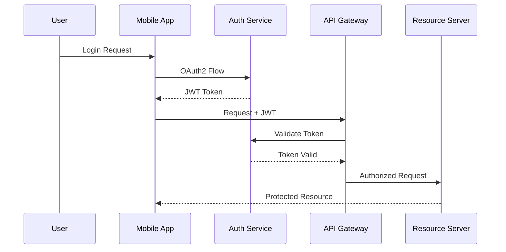

### 7.1.2 Authentication Methods

| Method | Implementation | Use Case |
|--------|---------------|----------|
| OAuth 2.0 | Auth0 Integration | Primary authentication |
| Social Auth | Sign in with Apple/Google | Alternative login |
| MFA | Time-based OTP | Premium accounts |
| Biometric | TouchID/FaceID | Local authentication |
| API Keys | JWT with RS256 | Service authentication |

### 7.1.3 Authorization Matrix

| Role | Upload Art | View Graphs | Export | Admin Features |
|------|------------|-------------|---------|----------------|
| Anonymous | Read Only | Basic View | No | No |
| Free User | Yes | Basic View | Limited | No |
| Premium | Yes | Full Access | Full | No |
| Admin | Yes | Full Access | Full | Yes |

## 7.2 DATA SECURITY

### 7.2.1 Data Protection Measures

```mermaid
flowchart TD
    A[Data Input] --> B{Encryption Layer}
    B --> C[Transport Security]
    B --> D[Storage Security]
    C --> E[TLS 1.3]
    C --> F[Certificate Pinning]
    D --> G[AES-256 Encryption]
    D --> H[Secure Enclave]
    G --> I[Database]
    H --> J[Credentials]
```

### 7.2.2 Encryption Standards

| Data State | Method | Key Management |
|------------|--------|----------------|
| In Transit | TLS 1.3 | AWS Certificate Manager |
| At Rest | AES-256-GCM | AWS KMS |
| In Memory | Secure Enclave | Hardware-based |
| Backups | AES-256-CBC | Offline Master Key |

### 7.2.3 Data Classification

| Category | Examples | Protection Level |
|----------|----------|-----------------|
| Public | Art Metadata | Basic Encryption |
| Internal | User Preferences | Standard Encryption |
| Sensitive | Payment Info | Enhanced Encryption |
| Critical | Auth Tokens | Maximum Security |

## 7.3 SECURITY PROTOCOLS

### 7.3.1 Security Controls

```mermaid
flowchart LR
    A[Security Layers] --> B[Prevention]
    A --> C[Detection]
    A --> D[Response]
    
    B --> E[Input Validation]
    B --> F[Access Control]
    B --> G[Encryption]
    
    C --> H[Logging]
    C --> I[Monitoring]
    C --> J[Alerting]
    
    D --> K[Incident Response]
    D --> L[Recovery]
    D --> M[Communication]
```

### 7.3.2 Security Monitoring

| Component | Tool | Metrics |
|-----------|------|---------|
| API Security | AWS WAF | Request patterns |
| App Security | App Shield | Runtime threats |
| Infrastructure | CloudWatch | System metrics |
| User Activity | Auth0 Logs | Login attempts |

### 7.3.3 Security Compliance Requirements

| Standard | Requirement | Implementation |
|----------|-------------|----------------|
| OWASP Mobile Top 10 | Secure Communication | Certificate Pinning |
| GDPR | Data Protection | Encryption at Rest |
| PCI DSS | Payment Security | Tokenization |
| CCPA | Privacy Controls | Data Minimization |

### 7.3.4 Security Update Protocol

| Phase | Action | Frequency |
|-------|--------|-----------|
| Assessment | Vulnerability Scanning | Weekly |
| Updates | Security Patches | Monthly |
| Review | Penetration Testing | Quarterly |
| Audit | Security Assessment | Annually |

### 7.3.5 Incident Response Plan

```mermaid
stateDiagram-v2
    [*] --> Detection
    Detection --> Analysis
    Analysis --> Containment
    Containment --> Eradication
    Eradication --> Recovery
    Recovery --> PostIncident
    PostIncident --> [*]
```

# 8. INFRASTRUCTURE

## 8.1 DEPLOYMENT ENVIRONMENT

### 8.1.1 Environment Overview

```mermaid
flowchart TD
    subgraph Production
        A[AWS Production] --> B[Multi-AZ Deployment]
        B --> C[Primary Region: us-east-1]
        B --> D[DR Region: us-west-2]
    end
    
    subgraph Staging
        E[AWS Staging] --> F[Single-AZ Deployment]
        F --> G[Region: us-east-2]
    end
    
    subgraph Development
        H[AWS Development] --> I[Single-AZ Deployment]
        I --> J[Region: us-east-2]
    end
```

### 8.1.2 Environment Specifications

| Environment | Purpose | Configuration | Scaling |
|-------------|---------|---------------|----------|
| Production | Live user traffic | Multi-AZ, Multi-Region | Auto-scaling groups |
| Staging | Pre-release testing | Single-AZ | Fixed capacity |
| Development | Development testing | Single-AZ | Minimal capacity |
| DR | Business continuity | Multi-AZ | Warm standby |

## 8.2 CLOUD SERVICES

### 8.2.1 AWS Service Selection

| Service | Purpose | Configuration |
|---------|---------|---------------|
| ECS Fargate | Container hosting | Serverless container execution |
| RDS | PostgreSQL database | Multi-AZ, 15.x version |
| ElastiCache | Redis caching | Cluster mode enabled |
| S3 | Object storage | Standard storage class |
| CloudFront | CDN | Edge locations worldwide |
| Route 53 | DNS management | Active-active routing |
| ELB | Load balancing | Application Load Balancer |
| AWS WAF | Web application firewall | OWASP rule set |

### 8.2.2 Cloud Architecture

```mermaid
flowchart TD
    subgraph Edge[Edge Layer]
        A[CloudFront] --> B[WAF]
        B --> C[Route 53]
    end
    
    subgraph Compute[Compute Layer]
        C --> D[ALB]
        D --> E[ECS Fargate]
    end
    
    subgraph Data[Data Layer]
        E --> F[RDS]
        E --> G[ElastiCache]
        E --> H[S3]
    end
```

## 8.3 CONTAINERIZATION

### 8.3.1 Container Strategy

| Component | Base Image | Size Limit | Configuration |
|-----------|------------|------------|---------------|
| API Service | python:3.11-slim | 250MB | Multi-stage build |
| Graph Service | python:3.11-slim | 500MB | ML dependencies |
| Auth Service | node:18-alpine | 150MB | Minimal image |
| Frontend Assets | nginx:alpine | 50MB | Static serving |

### 8.3.2 Container Architecture

```mermaid
flowchart LR
    subgraph Container Registry
        A[ECR] --> B[API Image]
        A --> C[Graph Image]
        A --> D[Auth Image]
    end
    
    subgraph ECS Cluster
        B --> E[API Tasks]
        C --> F[Graph Tasks]
        D --> G[Auth Tasks]
    end
```

## 8.4 ORCHESTRATION

### 8.4.1 ECS Configuration

| Service | CPU Units | Memory | Min Instances | Max Instances |
|---------|-----------|---------|---------------|---------------|
| API Service | 1024 | 2GB | 2 | 10 |
| Graph Service | 2048 | 4GB | 2 | 8 |
| Auth Service | 512 | 1GB | 2 | 6 |

### 8.4.2 Service Discovery

```mermaid
flowchart TD
    A[Route 53] --> B[Service Discovery]
    B --> C[API Service]
    B --> D[Graph Service]
    B --> E[Auth Service]
    
    subgraph Internal Routing
        C --> F[api.internal]
        D --> G[graph.internal]
        E --> H[auth.internal]
    end
```

## 8.5 CI/CD PIPELINE

### 8.5.1 Pipeline Architecture

```mermaid
flowchart LR
    A[GitHub] --> B[GitHub Actions]
    B --> C[Build]
    C --> D[Test]
    D --> E[Security Scan]
    E --> F[Deploy]
    
    subgraph Build
        C --> G[Lint]
        C --> H[Compile]
        C --> I[Package]
    end
    
    subgraph Deploy
        F --> J[Development]
        F --> K[Staging]
        F --> L[Production]
    end
```

### 8.5.2 Pipeline Stages

| Stage | Tools | SLA | Automation |
|-------|-------|-----|------------|
| Build | Docker, npm/pip | 5 min | Full |
| Test | pytest, Jest | 10 min | Full |
| Security | Snyk, SonarQube | 15 min | Full |
| Deploy Dev | Terraform | 10 min | Full |
| Deploy Staging | Terraform | 15 min | Manual Approval |
| Deploy Prod | Terraform | 20 min | Manual Approval |

### 8.5.3 Deployment Strategy

| Environment | Strategy | Rollback Time | Health Checks |
|-------------|----------|---------------|---------------|
| Development | Direct | Immediate | Basic |
| Staging | Blue/Green | < 5 min | Extended |
| Production | Blue/Green | < 2 min | Comprehensive |

# APPENDICES

## A.1 ADDITIONAL TECHNICAL INFORMATION

### A.1.1 Graph Database Query Performance

| Query Type | Max Response Time | Cache Duration | Optimization Strategy |
|------------|------------------|----------------|---------------------|
| Simple Node Lookup | 100ms | 1 hour | Index-based retrieval |
| 2-Level Traversal | 250ms | 30 minutes | Path caching |
| Complex Pattern Match | 500ms | 15 minutes | Query plan optimization |
| Full Graph Export | 2000ms | 24 hours | Async processing |

### A.1.2 Mobile Device Storage Management

```mermaid
flowchart TD
    A[Storage Manager] --> B{Check Space}
    B -->|Low Space| C[Cleanup Process]
    B -->|Sufficient| D[Normal Operation]
    C --> E[Clear Cache]
    C --> F[Remove Old Exports]
    C --> G[Compress Images]
    E --> H[Update Storage]
    F --> H
    G --> H
    H --> D
```

### A.1.3 Offline Capability Matrix

| Feature | Offline Support | Sync Strategy | Storage Limit |
|---------|----------------|---------------|---------------|
| Graph Viewing | Full | Background sync | 100MB |
| Basic Search | Limited | Index caching | 50MB |
| Image Upload | Queue | Upload on connect | 200MB |
| Metadata Edit | Full | Conflict resolution | 10MB |

## A.2 GLOSSARY

| Term | Definition |
|------|------------|
| Art Analysis Pipeline | Automated process for extracting and analyzing artwork metadata |
| Batch Processing | Handling multiple artwork uploads simultaneously |
| Cache Invalidation | Process of marking cached data as invalid when updates occur |
| Edge Computing | Processing data near the source of data generation |
| Graph Centrality | Measure of node importance within knowledge graph |
| Hot Path | Frequently accessed data paths optimized for performance |
| Lazy Loading | Technique to defer loading of non-critical resources |
| Node Expansion | Process of revealing additional relationships in graph view |
| Sharding | Database partitioning for improved scalability |
| Touch Gesture | User interaction through touch screen movements |
| Vector Similarity | Measurement of artwork style similarity using vectors |
| Warm Cache | Recently accessed data kept in memory for quick access |

## A.3 ACRONYMS

| Acronym | Expansion |
|---------|-----------|
| AAT | Art & Architecture Thesaurus |
| ALB | Application Load Balancer |
| AZ | Availability Zone |
| CDN | Content Delivery Network |
| CORS | Cross-Origin Resource Sharing |
| DDoS | Distributed Denial of Service |
| ECS | Elastic Container Service |
| ECR | Elastic Container Registry |
| ETL | Extract, Transform, Load |
| IAM | Identity and Access Management |
| IOPS | Input/Output Operations Per Second |
| JWT | JSON Web Token |
| KMS | Key Management Service |
| LRU | Least Recently Used |
| MFA | Multi-Factor Authentication |
| ORM | Object-Relational Mapping |
| PII | Personally Identifiable Information |
| RDS | Relational Database Service |
| S3 | Simple Storage Service |
| SDK | Software Development Kit |
| SLA | Service Level Agreement |
| SSL | Secure Sockets Layer |
| TTL | Time To Live |
| URI | Uniform Resource Identifier |
| VPC | Virtual Private Cloud |
| WAF | Web Application Firewall |
| XSS | Cross-Site Scripting |