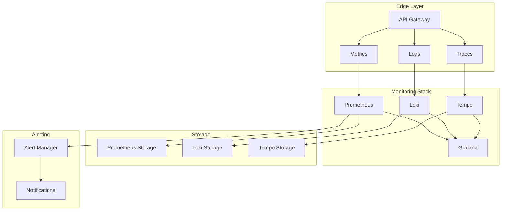

# Art Knowledge Graph Monitoring Infrastructure

## Overview

The Art Knowledge Graph monitoring infrastructure provides comprehensive observability across the entire application stack using a modern monitoring suite consisting of Prometheus, Grafana, Loki, and Tempo. This documentation covers the setup, architecture, and operational guidelines for maintaining a production-grade monitoring environment.

### Architecture Diagram



### Data Flow and Retention

| Component | Data Type | Retention Period | Storage Class |
|-----------|-----------|------------------|---------------|
| Prometheus | Metrics | 15 days | S3 Standard |
| Loki | Logs | 30 days | S3 IA |
| Tempo | Traces | 7 days | S3 Standard |
| Grafana | Dashboards | Persistent | EFS |

## Setup Instructions

### Version Requirements

| Component | Version | Docker Image |
|-----------|---------|--------------|
| Prometheus | 2.45.0+ | prom/prometheus:v2.45.0 |
| Grafana | 10.0.0+ | grafana/grafana:10.0.0 |
| Loki | 2.8.0+ | grafana/loki:2.8.0 |
| Tempo | 2.1.0+ | grafana/tempo:2.1.0 |

### ECS Deployment

```yaml
Task Definition Specifications:
- Prometheus:
    CPU: 1024
    Memory: 2048MB
    Storage: 100GB
- Grafana:
    CPU: 512
    Memory: 1024MB
    Storage: 20GB
- Loki:
    CPU: 1024
    Memory: 4096MB
    Storage: 500GB
- Tempo:
    CPU: 1024
    Memory: 2048MB
    Storage: 200GB
```

### High Availability Configuration

```yaml
Multi-AZ Setup:
- Primary: us-east-1a
  - Prometheus Primary
  - Grafana Active
  - Loki Distributor
  - Tempo Distributor

- Secondary: us-east-1b
  - Prometheus Secondary
  - Grafana Standby
  - Loki Ingester
  - Tempo Ingester

- Tertiary: us-east-1c
  - Prometheus Secondary
  - Grafana Standby
  - Loki Ingester
  - Tempo Ingester
```

## Component Details

### Prometheus Configuration

```yaml
global:
  scrape_interval: 15s
  evaluation_interval: 15s

scrape_configs:
  - job_name: 'api-gateway'
    metrics_path: '/metrics'
    static_configs:
      - targets: ['api-gateway:9090']

  - job_name: 'art-services'
    metrics_path: '/metrics'
    static_configs:
      - targets: ['art-service:9090']

alerting_rules:
  - name: high_error_rate
    rules:
      - alert: APIHighErrorRate
        expr: rate(http_requests_total{status=~"5.."}[5m]) > 0.1
        for: 5m
        labels:
          severity: critical
```

### Grafana Dashboards

1. API Gateway Dashboard
   - Request rates and latencies
   - Error rates and status codes
   - Geographic distribution
   - Rate limiting metrics

2. Service Metrics Dashboard
   - Service health status
   - Resource utilization
   - Cache hit rates
   - Database performance

3. Security Dashboard
   - Authentication attempts
   - Authorization failures
   - WAF metrics
   - Security group changes

### Loki Configuration

```yaml
auth_enabled: true

server:
  http_listen_port: 3100

ingester:
  lifecycler:
    ring:
      kvstore:
        store: memberlist
      replication_factor: 3

storage:
  type: s3
  s3:
    region: us-east-1
    bucket: art-knowledge-graph-logs
    retention_period: 30d
```

### Tempo Configuration

```yaml
server:
  http_listen_port: 3200

distributor:
  receivers:
    jaeger:
      protocols:
        thrift_http:
          endpoint: 0.0.0.0:14268

storage:
  trace:
    backend: s3
    s3:
      bucket: art-knowledge-graph-traces
      region: us-east-1
```

## Operations Guide

### Capacity Planning

| Component | Metric | Threshold | Action |
|-----------|--------|-----------|---------|
| Prometheus | Disk Usage | 70% | Increase storage |
| Prometheus | Memory Usage | 80% | Scale up |
| Loki | Ingest Rate | 100MB/s | Add ingesters |
| Tempo | Trace Storage | 70% | Adjust retention |

### Backup Procedures

1. Prometheus
   - Daily snapshots to S3
   - 30-day retention
   - Cross-region replication

2. Grafana
   - Dashboard JSON exports
   - Configuration backups
   - User database backups

3. Loki
   - Index snapshots
   - Log chunk backups
   - Configuration backups

### Incident Response

1. High Error Rate
   ```yaml
   Response Steps:
   1. Verify alert authenticity
   2. Check service logs
   3. Review trace data
   4. Analyze metrics spike
   5. Implement mitigation
   6. Document incident
   ```

2. Performance Degradation
   ```yaml
   Response Steps:
   1. Identify bottleneck
   2. Review resource usage
   3. Check scaling policies
   4. Analyze trace latencies
   5. Implement optimization
   6. Monitor improvement
   ```

## Security Considerations

### RBAC Configuration

```yaml
Grafana Roles:
  - Admin:
      permissions: ["*"]
  - Editor:
      permissions: ["view", "edit"]
  - Viewer:
      permissions: ["view"]

Prometheus Roles:
  - Admin:
      permissions: ["*"]
  - Operator:
      permissions: ["read", "write"]
  - Reader:
      permissions: ["read"]
```

### Network Security

```yaml
Security Groups:
  - Monitoring-Internal:
      ingress:
        - port: 9090
          source: VPC
        - port: 3000
          source: VPC
      egress:
        - port: all
          destination: VPC

  - Monitoring-External:
      ingress:
        - port: 443
          source: Corporate IP
      egress:
        - port: all
          destination: VPC
```

### Audit Logging

```yaml
Audit Configuration:
  - User Actions:
      - Login attempts
      - Dashboard changes
      - Alert modifications
      - Configuration updates
  
  - System Events:
      - Component restarts
      - Configuration reloads
      - Backup operations
      - Scale events
```

### Compliance Controls

1. Data Retention
   - Metrics: 15 days
   - Logs: 30 days
   - Traces: 7 days
   - Audit logs: 365 days

2. Access Control
   - SSO integration
   - MFA enforcement
   - IP whitelisting
   - Session management

3. Encryption
   - TLS 1.3 in transit
   - KMS at rest
   - Certificate rotation
   - Secure key management