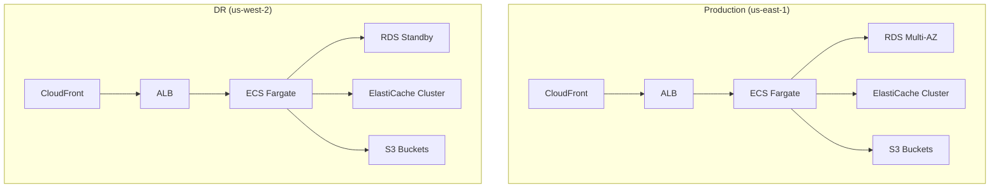

# Art Knowledge Graph Infrastructure

Comprehensive infrastructure-as-code implementation for the Art Knowledge Graph application using Terraform. This repository contains the complete deployment configuration for development, staging, and production environments with multi-region high availability setup.

## Table of Contents

- [Overview](#overview)
- [Prerequisites](#prerequisites)
- [Directory Structure](#directory-structure)
- [Module Documentation](#module-documentation)
- [Environment Configuration](#environment-configuration)
- [Security Implementation](#security-implementation)
- [Deployment Instructions](#deployment-instructions)
- [Monitoring and Maintenance](#monitoring-and-maintenance)

## Overview

The Art Knowledge Graph infrastructure is deployed across multiple AWS regions with the following configuration:

- Primary Region: us-east-1 (Production/Staging)
- DR Region: us-west-2 (Disaster Recovery)
- Development Region: us-east-2



## Prerequisites

### Required Tools
- Terraform >= 1.0.0
- AWS CLI >= 2.0.0
- Git >= 2.0.0

### AWS Account Setup
```hcl
# Required IAM permissions for Terraform deployment
{
  "Version": "2012-10-17",
  "Statement": [
    {
      "Effect": "Allow",
      "Action": [
        "ec2:*",
        "ecs:*",
        "rds:*",
        "elasticache:*",
        "s3:*",
        "cloudfront:*",
        "route53:*",
        "waf:*"
      ],
      "Resource": "*"
    }
  ]
}
```

## Directory Structure

```
terraform/
├── environments/
│   ├── dev/
│   │   ├── main.tf
│   │   ├── variables.tf
│   │   └── outputs.tf
│   ├── staging/
│   │   └── [...]
│   └── prod/
│       └── [...]
├── modules/
│   ├── ecs/
│   ├── rds/
│   ├── elasticache/
│   ├── neo4j/
│   └── security/
├── shared/
│   ├── vpc/
│   └── monitoring/
└── provider.tf
```

## Module Documentation

### ECS Module
```hcl
module "ecs" {
  source = "./modules/ecs"
  
  environment = var.environment
  vpc_id     = module.vpc.vpc_id
  
  container_definitions = {
    api_service = {
      cpu    = 1024
      memory = 2048
      count  = 2
    }
    graph_service = {
      cpu    = 2048
      memory = 4096
      count  = 2
    }
  }
}
```

### RDS Module
```hcl
module "rds" {
  source = "./modules/rds"
  
  engine_version = "15.x"
  instance_class = "db.r6g.large"
  multi_az      = true
  
  backup_retention_period = 7
  backup_window          = "03:00-04:00"
}
```

## Environment Configuration

### Production Environment
- Multi-AZ deployment
- Auto-scaling enabled
- Enhanced monitoring
- Cross-region replication

### Staging Environment
- Single-AZ deployment
- Limited scaling
- Standard monitoring

### Development Environment
- Single-AZ deployment
- Minimal resources
- Basic monitoring

## Security Implementation

### Encryption Configuration
```hcl
# Data at rest encryption
resource "aws_kms_key" "encryption_key" {
  description = "KMS key for data encryption"
  enable_key_rotation = true
  
  tags = {
    Environment = var.environment
    Purpose     = "data-encryption"
  }
}

# TLS configuration
resource "aws_acm_certificate" "cert" {
  domain_name       = "*.artknowledgegraph.com"
  validation_method = "DNS"
  
  lifecycle {
    create_before_destroy = true
  }
}
```

### WAF Rules
```hcl
resource "aws_wafv2_web_acl" "main" {
  name        = "art-knowledge-graph-waf"
  description = "WAF rules for Art Knowledge Graph"
  scope       = "REGIONAL"
  
  default_action {
    allow {}
  }
  
  rule {
    name     = "AWSManagedRulesCommonRuleSet"
    priority = 1
    
    override_action {
      none {}
    }
  }
}
```

## Deployment Instructions

### Initial Deployment
```bash
# Initialize Terraform
terraform init -backend-config=environments/${ENV}/backend.hcl

# Validate configuration
terraform validate

# Plan deployment
terraform plan -var-file=environments/${ENV}/terraform.tfvars

# Apply changes
terraform apply -var-file=environments/${ENV}/terraform.tfvars
```

### Infrastructure Updates
1. Create feature branch
2. Make infrastructure changes
3. Run terraform fmt and terraform validate
4. Create pull request
5. Review and approve changes
6. Merge and deploy

## Monitoring and Maintenance

### CloudWatch Alarms
```hcl
resource "aws_cloudwatch_metric_alarm" "high_cpu" {
  alarm_name          = "high-cpu-utilization"
  comparison_operator = "GreaterThanThreshold"
  evaluation_periods  = "2"
  metric_name        = "CPUUtilization"
  namespace          = "AWS/ECS"
  period             = "300"
  statistic          = "Average"
  threshold          = "80"
  
  alarm_actions = [aws_sns_topic.alerts.arn]
}
```

### Maintenance Windows
- Security patches: Weekly (Sundays 02:00-04:00 UTC)
- Database maintenance: Monthly (First Sunday 03:00-05:00 UTC)
- Infrastructure updates: Quarterly or as needed

### Backup Strategy
- RDS: Daily automated backups with 7-day retention
- S3: Cross-region replication enabled
- ElastiCache: Daily snapshots with 3-day retention

## Disaster Recovery

### Failover Procedure
1. Update Route 53 DNS records
2. Promote DR region RDS to primary
3. Scale up DR region resources
4. Verify application health
5. Update monitoring and alerts

### Recovery Time Objectives
- RTO: < 1 hour
- RPO: < 15 minutes

## Cost Optimization

### Resource Tagging
```hcl
locals {
  common_tags = {
    Project     = "art-knowledge-graph"
    Environment = var.environment
    ManagedBy   = "terraform"
  }
}
```

### Auto-scaling Policies
```hcl
resource "aws_appautoscaling_target" "ecs_target" {
  max_capacity       = 10
  min_capacity       = 2
  resource_id        = "service/${aws_ecs_cluster.main.name}/${aws_ecs_service.main.name}"
  scalable_dimension = "ecs:service:DesiredCount"
  service_namespace  = "ecs"
}
```

## Support and Maintenance

### Contact Information
- Infrastructure Team: infrastructure@artknowledgegraph.com
- Emergency Support: oncall@artknowledgegraph.com

### Documentation Updates
This documentation should be reviewed and updated:
- Quarterly
- Upon major infrastructure changes
- After security audits
- Following incident postmortems

---

Last Updated: 2024
Maintainers: Infrastructure and DevOps Team